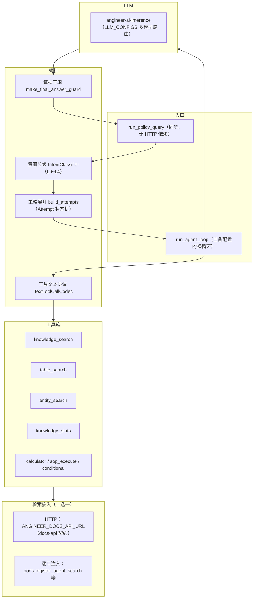

# angineer-core

[](https://pypi.org/project/angineer-core/)

AnGIneer 的问答编排内核（Agent Harness 引擎，纯 Python 库，非服务）：一条
**意图分级 → 策略展开 → 多轮工具调用 → 证据守卫 → 出处标注** 的完整链路。

> 定位：本库**不含 HTTP 服务、不含知识库存储、不含检索配方**。
> LLM 调用交给 [angineer-ai-inference](https://pypi.org/project/angineer-ai-inference/)；
> 检索实现由消费方注入——要么通过端口注册挂进本进程，要么配 `ANGINEER_DOCS_API_URL` 走 HTTP。

## 功能架构



## 安装

```bash
# PyPI（推荐）
pip install angineer-core

# 或从 GitHub 钉版本安装
pip install "angineer-core @ git+https://github.com/0mao0/angineer-core.git@v0.1.0"

# 本地开发（主仓库 AnGIneer 内）
pip install -e services/angineer-core
```

Python 要求 `>=3.10`；依赖：`angineer-ai-inference`、`pydantic>=2.0,<3.0`、
`python-dotenv>=1.0`、`requests>=2.31`、`jsonschema`。

## 快速开始

两步就位：配 LLM（`LLM_CONFIGS`，格式见 [angineer-ai-inference](https://pypi.org/project/angineer-ai-inference/)），
再指一条检索来源——下面是走 HTTP 的最小例子。

```bash
export LLM_CONFIGS='[{"name":"Qwen3.6-A3B","model":"Qwen3.6-35B-A3B-FP8","api_key":"sk-...","base_url":"https://your-gateway/v1","enabled":true,"priority":10}]'
export ANGINEER_DOCS_API_URL="https://your-docs-api"
```

```python
from angineer_core.policy_query import run_policy_query

result = run_policy_query("隧道二次衬砌的最小厚度是多少？", library_id="default")

print(result["answer"])        # 最终回答（含 cite 标记）
print(result["citations"])     # 出处（来自检索项的 page/cite 字段）
print(result["intent"])        # 意图分级结果（L0~L4 / service_mode）
print(result["llm_errors"])    # 空列表＝没有静默降级的 LLM 失败
```

`run_policy_query` 不依赖 HTTP / FastAPI / asyncio，可在后台线程直接调用。
返回值是字典：`answer` / `citations` / `retrieved_items` / `evidences` / `intent` /
`trace_notes` / `stage_timings` / `prompt_versions` / `llm_errors` / `runtime_flags` 等。

## 两条检索接入路径

引擎只认协议，不认识任何具体检索实现；下表的两种接法效果等价，任选其一。

| 路径 | 怎么接 | 未接时表现 |
| :--- | :--- | :--- |
| **HTTP**（推荐给独立部署） | 配 `ANGINEER_DOCS_API_URL` 指向 docs-api 兼容服务；引擎调 4 个端点：`/api/knowledge/internal/retrieve`、`/internal/entity-search`、`/internal/doc-nodes`、`/internal/graph-append-note` | 未配置则走本地回退（端口路径） |
| **端口注入**（推荐给嵌入式） | 进程内调 `angineer_core.ports.register_*`，把自家检索实现挂上 | 未注册的端口按降级语义走「警告 + 空结果」，对应工具不可用 |

```python
from angineer_core import ports

ports.register_local_nodes_loader(lambda library_id, doc_ids: my_nodes(library_id, doc_ids))
ports.register_local_rerank(lambda query, task_type, candidates: my_rerank(query, task_type, candidates))
ports.register_agent_search(
    normalize_query=my_normalize_query,      # "第六十条" → "第60条"，不接则原样透传
    knowledge_local=my_knowledge_search,     # 只做正文问答时，这个端口是必需的
    table_local=my_table_search,
    entity_local=my_entity_search,
    local_stats=my_local_stats,
    engtool_registry=my_tool_registry,       # calculator / conditional 等外部工具
    relevant_citations=my_relevant_citations,
    table_blocks=my_table_blocks,
)
```

只做正文问答（不查表、不查图谱、不做统计）的最小实现 = 注册 `knowledge_local` 一个端口；
表格题 / 实体查 / 统计题 / SOP / 计算器各自是独立端口，按需补齐。

**检索项契约**（换任何实现都要守，缺字段只会静默退化、不报错）：

- `item_id` / `doc_id` / `title` / `text` / `score` / `metadata` 字段齐全；
- 建议在 `metadata` 里带 `doc_title`：引擎据此给证据文本拼 `《书名》` 前缀，
  出处守卫也靠它核对答案里引用的规范名（核不到会被替换成拒答话术）；
- 页码等定位字段随 `metadata` 透传，`citations` 由引擎按检索顺序分配标注。

## 意图分级与策略展开

`IntentClassifier` 输出 L0~L4，`build_attempts` 按级别展开尝试序列（前一级失败自动降级到下一级）：

| 级别 | 含义 | Attempt 序列 |
| :--- | :--- | :--- |
| L0 | 闲聊 / 寒暄 | 直答（不调工具） |
| L1 | 正文问答 | 语义检索（`enforce_evidence=True`，无证据拒答） |
| L2 | 条款 / 表格定位 | `table_search` 优先，无证据降级 L1 |
| L3 | 规范计算 | 复杂档：QA 三件套 + `sop_execute` + `calculator` + `conditional`，最多 8 轮 |
| L4 | 复杂综合 | 同 L3（复杂档只按 level 记标签，编排一致） |

## 事件协议

`run_agent_loop` 通过 `emit` 回调吐 `AgentEvent(type, run_id, turn, ts, payload)`：

```text
run_start / run_end
turn_start / turn_end
message_start / message_delta / message_end
tool_start / tool_end
note（过程说明） / answer（守卫替换后的最终回答） / error
```

按 `run_id` 归并以还原「思考过程（N 步 · 工具耗时 X）」；`meta` 字段永不进 LLM 上下文。

## 证据守卫

`make_final_answer_guard(enforce_evidence)` 在回答出栈前做四道检查：

1. 全程没有有效证据 → 拒答；
2. 答案引用未检索到的规范编号 / 书名号标题 → 替换为拒答话术（标题类为「全部核不到才拦」，部分核到的次级引用放行）；
3. 编造 `[KTE]` 标记 → 移除标记，不拒答；
4. 已有证据却整段拒答 → 终段定向重试一次，仍拒答则保留原文并留 trace 注记。

## 环境变量

配置全部来自环境变量；LLM 侧变量（`LLM_CONFIGS` / `ANGINEER_*` 超时重试等）见
angineer-ai-inference README，这里只列引擎自身常用的：

| 变量 | 默认 | 说明 |
| :--- | :--- | :--- |
| `ANGINEER_DOCS_API_URL` | 空 | docs-api 基址；配了就优先走 HTTP 检索 |
| `ANGINEER_DOCS_API_TIMEOUT` | 30 | docs-api 请求超时（秒） |
| `ANGINEER_DISABLE_LOCAL_FALLBACK` | 0 | 置 1 时禁止本地回退（HTTP 失败即空结果，不发跨进程直读） |
| `ANGINEER_CONTEXT_TOP_N` | 15 | rerank 后进上下文的证据条数上限 |
| `ANGINEER_QA_PROMPT_VERSION` | latest | QA 档提示词版本（`v17` / `latest`，随包发布） |
| `ANGINEER_FIRST_TOKEN_LIVENESS_S` | 90 | 流式首字存活线（秒），0 = 关闭；防上游挂起不返回 |
| `ANGINEER_ROUTE_PARALLEL` | true | 赌博式预检：请求进来就并行预跑一次 L1 检索 |
| `ANGINEER_EAGER_COMPRESS` | false | 激进压缩开关：每轮即压跨对话证据，不等预算阈值 |
| `ANGINEER_LOG_LEVEL` | INFO | 日志级别 |

## 不在本库范围

- HTTP / SSE 服务端点（由消费方，如 AnGIneer 的 aichat-api 实现）；
- 知识库存储、向量检索、rerank、解析入库（由消费方或 docs-api 提供）；
- 会话池与聊天历史持久化（本库给 `AgentSession` 结构，落库由消费方决定）；
- LLM 客户端本身（走 angineer-ai-inference）。

## 开发与测试

```bash
pip install -e ".[dev]"
python -m pytest tests -q
```

测试覆盖：意图分类降级、策略展开、工具箱组成、答案形态注入、上下文截断、
证据指针与跨轮压缩、多库作用域与检索 memo、检索端口双轨。依赖 docs-core 的集成用例
在未安装 docs-core 的环境自动跳过（当前 70 passed / 6 skipped）。

架构说明（Agent Harness 详解、工具协议、关键踩坑）见主仓库
[docs/angineer-core/agent-harness.md](https://github.com/0mao0/AnGIneer/blob/main/docs/angineer-core/agent-harness.md)。

## 许可

MIT
